# audio_module — ASR и TTS-аугментация

Модуль отвечает за аудио в проекте «Классификация спама и кликбейта» (кейс 4):

- **Онлайн (inference-api):** голосовое из Telegram → текст для классификатора.
- **Офлайн (обучение):** тексты из `df.csv` → TTS → шум/скорость/Opus → ASR → «шумные» транскрипты для обогащения тренировочного датасета (усложнение кейса).

Выбор моделей согласован с `ConceptAndArchitecture/после ревью/v2` (ADR-14, раздел 4 архитектуры).

| Задача | Модель | Статус |
|---|---|---|
| ASR (основной) | **GigaAM-v3 `v3_e2e_rnnt`** (MIT, русский, CPU) | в пайплайне |
| VAD | Silero VAD (порог 0.5, ≥250 мс речи, пауза >300 мс) | в пайплайне |
| LID | faster-whisper `base`, int8, только `detect_language` | в пайплайне |
| ASR (бейзлайн для E-1) | faster-whisper `large-v3-turbo` | `backend="whisper"` |
| TTS | Silero `v4_ru` (5 голосов); Piper — как в архитектуре | `PiperBackend` (нужны .onnx-голоса) |

## 1. Схема интеграции

```mermaid
flowchart TD
    subgraph Online["Онлайн: inference-api (FastAPI)"]
        B["bot (aiogram)"] -- "POST /v1/classifications<br/>multipart: audio" --> API[endpoint]
        API --> ASR["STTService.transcribe()<br/>FFmpeg → Silero VAD → LID → GigaAM"]
        ASR -- "ASRResult.status == ok" --> CT["clean_text (textnorm)"]
        CT --> CL["TF-IDF + LR классификатор"]
        CL --> RES["label / scores / confidence"]
        ASR -- "not_classified:<br/>no_speech · speech_too_short ·<br/>unsupported_language" --> RES
        RES --> B
    end
    subgraph Offline["Офлайн: dvc repro / обучение"]
        DF["df.csv (text, label)"] --> BLD["build_tts_dataset.py<br/>фильтр 10–80 слов, sanitize"]
        BLD --> TTS["TTSAugmenter<br/>Silero/Piper + шум + скорость ±10 % + Opus 16–32 кбит/с"]
        TTS --> OGG["data/tts_dataset/audio/*.ogg + meta.jsonl<br/>(split=train, synthetic=true)"]
        OGG --> ASR2["STTService (тот же ASR)"]
        ASR2 --> NOISY["asr_text — «шумные» транскрипты"]
        NOISY --> TR["обучение классификатора (E-2a)"]
    end
```



Принцип: **в обучении и в проде транскрипты получает один и тот же `STTService`**, поэтому классификатор учится на ошибках именно той модели, что работает на инференсе.

## 2. Контракт модуля

Вход: путь к файлу (`ogg/opus`, `m4a`, `mp3`, `wav`), длительность ≤ 300 с.
Выход — `ASRResult.to_dict()`:

```json
{
  "status": "ok",                      // ok | not_classified
  "reason": null,                      // no_speech | speech_too_short | unsupported_language
  "text": "срочно вы выиграли приз ...",
  "language": "ru", "language_prob_ru": 0.99,
  "duration_s": 12.4, "speech_s": 9.8,
  "asr_model": "gigaam-v3_e2e_rnnt", "lid_model": "faster-whisper-base",
  "segments": [{"start_s": 0.4, "end_s": 12.1, "text": "..."}],
  "timings_ms": {"decode": 40, "vad": 120, "lid": 300, "asr": 2100, "total": 2560}
}
```

Исключения (наследники `AudioError`, у каждого есть `.code`): `AudioDecodeError` (`decode_failed`), `AudioTooLongError` (`too_long`). `inference-api` должен превращать их в HTTP 4xx.

Пример вызова из `inference-api` (модели грузятся один раз при старте):

```python
from fastapi import FastAPI, UploadFile
from audio_module.stt_service import STTService
from audio_module.audio_io import AudioError
import tempfile, shutil

app = FastAPI()
stt = STTService("gigaam")

@app.post("/v1/classifications")
async def classify(audio: UploadFile):
    with tempfile.NamedTemporaryFile(suffix=".ogg") as tmp:
        shutil.copyfileobj(audio.file, tmp); tmp.flush()
        try:
            asr = stt.transcribe(tmp.name)
        except AudioError as e:
            return {"status": "error", "reason": e.code}
    if asr.status != "ok":
        return {"status": asr.status, "reason": asr.reason, "asr_model": asr.asr_model}
    # label = classifier.predict(clean_text(asr.text)) ...
    return {"status": "ok", "text": asr.text}   # + label/scores/confidence
```

## 3. Запуск

```bash
sudo apt install ffmpeg
pip install -r audio_module/requirements.txt
pip install git+https://github.com/salute-developers/GigaAM.git

pytest audio_module/tests                      # 11 тестов, тяжёлые модели не нужны
python -m audio_module.stt_service voice.ogg   # ASR одного файла (JSON)
python -m audio_module.roundtrip_check         # TTS -> ASR -> WER, проверка всей связки
python -m audio_module.benchmark_asr --audio-dir samples/ --refs samples/refs.tsv --backends gigaam,whisper
python -m audio_module.build_tts_dataset --csv Datasets/df.csv --out data/tts_dataset --per-class 200 --transcribe
```

Первый запуск скачивает веса (GigaAM, Silero, faster-whisper) — нужен интернет; оценка памяти по архитектуре ≈ 3–4 ГБ RAM.

## 4. Результаты тестирования

| Модель | Файлов | WER | RTF (CPU) | Железо |
|---|---|---|---|---|
| gigaam-v3_e2e_rnnt | | | | |
| faster-whisper-large-v3-turbo | | | | |

## 5. Ограничения и заметки

- Silero TTS не читает латиницу: при подготовке датасета латиница отбрасывается, цифры превращаются в слова (`num2words`). Тексты после очистки короче 3 слов пропускаются.
- Синтетические записи помечены `split=train`, `synthetic=true`. **Их нельзя использовать в `voice-calib` и `voice-holdout`** — иначе модель выучит «робот = спам» (риск из ADR).
- `Silero VAD` режет речь на сегменты ≤ 20 с, потому что `transcribe` GigaAM принимает до 25 с.
- Если по результатам E-1 победит не GigaAM, смена модели — одна строка (`STTService("whisper")`) и запись в журнал решений.
