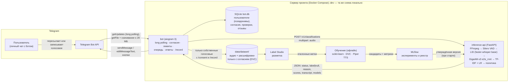
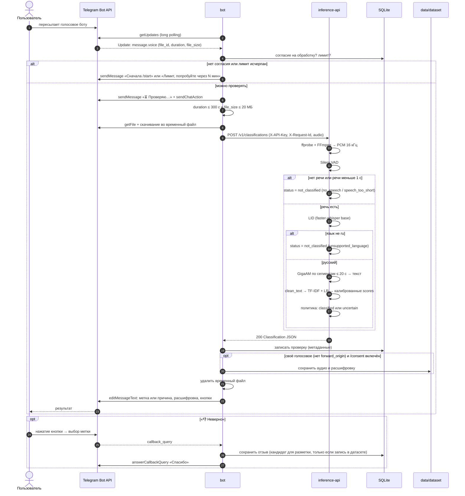
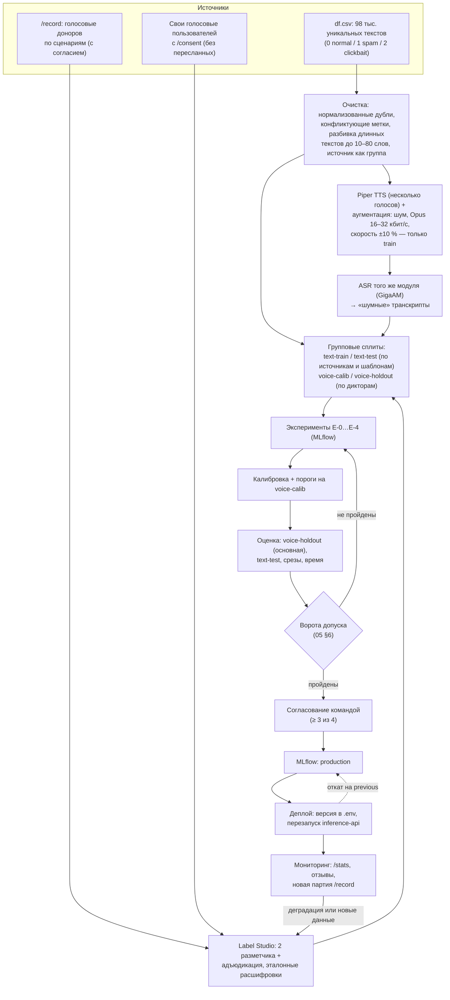

# 03. Итоговая архитектура

Статус: **версия 2.0 от 01.10.2026, проект для согласования**.
Концепт: `02-final-concept.md`. Контракт сервиса инференса: `04-service-contract.openapi.yaml`. Решения: `06-decisions-and-roadmap.md`.

## 1. Итог в одном абзаце

На **сервере проекта** (prod) в Docker Compose работают два основных процесса. Тот же `compose.yaml` каждый участник запускает **локально в Docker** (dev) со своим тестовым ботом (§11.1):

- **`bot`** на aiogram получает голосовые из Telegram через long polling. Публичный IP и вебхук не нужны. Бот ведёт пользователей, согласия, историю и обратную связь в SQLite и сохраняет согласованные записи в датасет.
- **`inference-api`** на FastAPI — сервис без состояния. Он декодирует аудио (FFmpeg), выделяет речь (Silero VAD), определяет язык (faster-whisper `base`), распознаёт речь (GigaAM-v3 `v3_e2e_rnnt`), классифицирует текст (TF-IDF + логистическая регрессия с калибровкой) и применяет политику решения.

Обучение идёт офлайн: на сервере или на машине участника в Docker-профиле `ml`. При этом DVC фиксирует данные, MLflow — эксперименты и реестр, Label Studio — разметку, Piper — TTS-обогащение. Модель выпускается только через ворота качества и согласие команды.

## 2. Компоненты

| Компонент | Обязанности | Интерфейсы |
|---|---|---|
| `bot` | Long polling (`getUpdates`, `allowed_updates = [message, callback_query]`); `/start` с согласием; `/consent`, `/record`, `/delete_me`, `/privacy`, `/help`, `/stats`; приём `voice` и `audio`/`document audio/*`; проверка `duration` и `file_size` до скачивания; скачивание во временный файл; очередь (2 параллельных запроса к inference-api, остальные ждут); лимит 30 проверок в час на пользователя; ответ и кнопки; запись в SQLite; сохранение в датасет по правилам `02` §8; удаление временного файла | Bot API; REST `04`; SQLite |
| `inference-api` | Проверка формата (`ffprobe`), декодирование в 16 кГц моно (FFmpeg в подпроцессе с таймаутом); Silero VAD; при отсутствии речи или речи < 1 с — `not_classified`; LID по первым 30 с речи; сегменты речи ≤ 20 с → GigaAM `transcribe`; склейка текста; классификатор; политика решения; JSON-логи без содержимого | REST `04`; файлы моделей в томе `models/` |
| SQLite | Таблицы §6 | SQLAlchemy |
| `data/dataset/` | Аудио (`.ogg`) и `meta.json` (метка сценария, расшифровка, псевдоним донора, источник `own`/`record`) | DVC |
| MLflow | Метрики, артефакты, реестр (алиасы `candidate`, `production`, `previous`) | HTTP, запускается по требованию |
| Label Studio | Двойная разметка, адъюдикация | HTTP, запускается по требованию |
| Обучение | `dvc repro`: подготовка → TTS → обучение → калибровка → оценка → отчёт | DVC, MLflow |

Почему `bot` и `inference-api` разделены. Распознавание речи нагружает CPU на секунды и не должно блокировать приём сообщений. ML-участники команды тестируют модель через Swagger UI без Telegram. Контракт `04` фиксирует границу между частями проекта.

### 2.1. Контракт бота (пользовательский интерфейс)

| Вход | Условие | Ответ бота |
|---|---|---|
| `/start` | — | Описание, ссылка на `/privacy`, кнопка «Согласен на обработку» |
| `/privacy` | — | Политика: что обрабатывается, что хранится, как удалить |
| `/consent` | — | Переключатель «Использовать мои **собственные** голосовые для обучения» (выключен по умолчанию); при отзыве — удаление записей пользователя из датасета |
| `/record` | Согласие на обучение | Сценарий записи; принятое голосовое → «✅ Записано, спасибо» |
| `voice`, `audio`, `document audio/*` | Согласие на обработку, лимит | «⏳ Проверяю…» → результат по `02` §6 + расшифровка + кнопки |
| Кнопка «👎 Неверно» | — | Выбор метки → «Спасибо, учтём» |
| Кнопка «🗑 Удалить» | — | Удаление проверки → «Удалено» |
| Кнопка «🔁 Повторить» | Ошибка проверки | Повторная проверка того же `file_id` |
| `/delete_me` | — | Подтверждение → удаление всех данных пользователя |
| `/stats` | Только участники команды | Сводка §10 |
| Текст, фото и прочее | — | «Пришлите голосовое сообщение» |

## 3. Выбор подхода к распознаванию смысла

| Критерий | A. ASR + текстовый классификатор | B. Прямая аудиоклассификация (CNN, Wav2Vec2/HuBERT → softmax) | C. Гибрид: текст + акустика |
|---|---|---|---|
| Как распознаётся смысл | Явно, по словам: «перезвоните», «код из СМС», «ты не поверишь» | Неявно, нужен большой реальный аудиодатасет | Как A + просодия, музыка, «роботизированность» |
| Данные команды | Подходит: 98 тыс. уникальных текстов `df.csv` и готовый baseline | Реальных голосовых пока нет | Нужны оба вида данных |
| Риск | Ошибки ASR, смещение источников текстов | Выучит артефакты TTS | Ложная корреляция «робот = спам» |
| Ресурсы | CPU | GPU для дообучения | GPU |

**Выбор.** Baseline — вариант A, он совпадает с текущим `model.ipynb`. Развитие — rubert-tiny2 на транскриптах (E-3). Вариант C — только эксперимент E-4. Вариант B отклонён. LLM в онлайн-контуре нет.

## 4. ASR: состав модуля

| Шаг | Компонент | Параметры [решение] |
|---|---|---|
| Декодирование | FFmpeg/ffprobe | ogg/opus, m4a/aac, mp3, wav → PCM 16 кГц моно; таймаут 15 с; `-protocol_whitelist file,pipe` |
| VAD | Silero VAD | Порог 0.5; минимальная речь 250 мс; паузы > 300 мс разделяют сегменты; сегменты склеиваются до ≤ 20 с |
| Язык | faster-whisper `base`, int8, только `detect_language` | По первым ≤ 30 с речи; `unsupported_language`, если вероятность «не ru» ≥ 0.70 |
| Распознавание | GigaAM-v3 `v3_e2e_rnnt` (PyTorch, CPU; ONNX — эксперимент E-1b) | Сегменты ≤ 20 с (лимит `transcribe` — 25 с); текст с пунктуацией и цифрами |
| Нормализация для классификатора | Та же функция `clean_text`, что в обучении (`model.ipynb`, ячейка 15), вынесена в общий пакет `textnorm` | Одинаковая обработка при обучении и инференсе |

Сравнение в E-1: `v3_e2e_rnnt`, `v3_e2e_ctc`, `v3_rnnt` и Whisper `large-v3-turbo` (faster-whisper) на реальном holdout по WER и времени. Если выиграет не `v3_e2e_rnnt`, смена модели оформляется решением с записью в журнал.

## 5. Основной сценарий

Обработка синхронная: одно голосовое целиком → один ответ. Потоковой передачи нет.

Политика решения `decision_policy@1` [решение]:

1. Речи нет → `no_speech`; речи < 1.0 с → `speech_too_short`.
2. Вероятность «не ru» ≥ 0.70 → `unsupported_language`.
3. Если лучший класс `spam` и `p_spam ≥ τ_spam`, или лучший класс другой и `p_max ≥ τ`, → `classified`. Иначе → `uncertain/low_confidence`.
4. Стартовые значения до калибровки: τ = 0.55, τ_spam = 0.65. После E-5 пороги подбираются на калибровочной выборке так, чтобы precision `spam` была ≥ 0.85 при максимальном coverage, и записываются в `decision_policy@2`.

## 6. Хранилища и сущности (SQLite)

| Таблица | Поля | Удаление |
|---|---|---|
| `user` | `uid_hash` (SHA-256 от Telegram `user_id` с солью), `processing_consent_at`, `training_consent_at`, `training_consent_revoked_at`, `created_at` | `/delete_me` |
| `check` | `id`, `uid_hash`, `created_at`, `kind` (`own`/`forwarded`/`record`/`file`), `duration_s`, `status`, `reason`, `label`, `scores`, `confidence`, `detected_language`, `asr_model`, `lid_model`, `classifier_model`, `decision_policy`, `timings_ms`, `dataset_item_id` (null, если не сохранено) | «🗑 Удалить», `/delete_me` |
| `feedback` | `check_id`, `user_label`, `created_at` | Вместе с `check` |
| `record_prompt` | `id`, `target_label`, `prompt_text`, `kind` (`read`/`retell`) | — |

Расшифровка в SQLite **не хранится**. Она есть только в ответе пользователю (в Telegram) и в `data/dataset/` для записей с согласием. Секреты — токен бота, соль, `X-API-Key` — лежат в `.env`, который не попадает в git. Каталоги `data/` и `models/` на сервере лежат на зашифрованном томе; доступ к серверу — только по SSH-ключам участников команды.

## 7. Офлайн-обучение

## 8. Безопасность, ошибки и деградация

**Безопасность.**

- Токен бота лежит только в `.env`. При утечке его перевыпускают через @BotFather.
- `inference-api` слушает только внутреннюю сеть Compose и `127.0.0.1` (для Swagger), с заголовком `X-API-Key`.
- На сервере открыт только SSH: long polling работает на исходящих соединениях, поэтому HTTPS-сертификат и открытый порт для бота не нужны. MLflow и Label Studio доступны через SSH-туннель.
- Файл проверяется до скачивания (`duration`, `file_size` из `Voice`/`Audio`) и после: `ffprobe` проверяет содержимое, а не расширение. Подпроцесс FFmpeg ограничен таймаутом.
- Сервис не скачивает аудио по URL из сообщений пользователя (защита от SSRF). Бот скачивает файлы только с `api.telegram.org` по `file_path` из `getFile`.
- `/stats` доступна только Telegram ID участников команды (список в `.env`).
- В логах нет текста, аудио и Telegram ID — только псевдонимы и `request_id`.

**Ошибки и повторы.**

| Ситуация | Поведение |
|---|---|
| Бот или сервер перезапускаются | Telegram хранит обновления до 24 ч; после старта бот обрабатывает очередь и отвечает (сообщение «извините за задержку», если прошло > 5 мин) |
| `duration > 300` или `file_size > 20 МБ` | Без скачивания: «⚠️ Слишком длинное голосовое (максимум 5 минут)» |
| Ошибка `getFile` или скачивания, сеть | 2 повтора (паузы 2 и 8 с), затем «⚠️ Ошибка проверки» + «🔁 Повторить» |
| `inference-api` 503 (`overloaded`, `processing_timeout`, `maintenance`) или 500 | 2 повтора с паузой не меньше `Retry-After`, затем «⚠️ Ошибка проверки» + «🔁 Повторить» |
| 413, 415, 422 | Без повтора: «⚠️ Формат не поддерживается / файл повреждён / слишком длинный» |
| Очередь > 2 | «⏳ В очереди: N»; если ожидание > 120 с — «⚠️ Сервер перегружен, попробуйте позже» |
| `not_classified`, `uncertain` | Ответ по `02` §6, **никогда** не «Обычное» |

## 9. Производительность: цели и бюджет

Цифры ниже — цели [решение], проверяются тестом T-PERF (`05` §7). Пример — голосовое 60 с (Opus ≈ 32 кбит/с ≈ 240 КБ):

| Участок | Цель p95 |
|---|---|
| Получение апдейта + `getFile` + скачивание | ≤ 2 с |
| Ожидание в очереди (нагрузка A-03) | ≤ 2 с |
| Декодирование + VAD | ≤ 1 с |
| LID (faster-whisper `base`, ≤ 30 с речи) | ≤ 2 с |
| GigaAM-v3 на CPU, 60 с речи | ≤ 8 с |
| Классификация + политика | ≤ 50 мс |
| **Всего до ответа (N-1)** | **≤ 15 с** |

Ресурсы (оценка, уточняется измерением):

- `inference-api` с GigaAM (≈ 220 млн параметров), faster-whisper `base` и TF-IDF — ≈ 3–4 ГБ RAM;
- `bot` — ≈ 0.2 ГБ;
- MLflow и Label Studio при запуске — ≈ 1.5 ГБ.

На сервере из A-01 (16 ГБ) запас достаточен. Если на сервере есть GPU, GigaAM можно запускать на нём; это не требование. Для локального dev-окружения нужно ≈ 6 ГБ свободной RAM.

## 10. Мониторинг

- **`/stats` (для команды):** число проверок за сутки и неделю; доли `classified`/`uncertain`/`not_classified` по причинам; распределение меток; доля «👎 Неверно»; p50/p95 времени по участкам из `timings_ms`; число ошибок.
- **Журнал `inference-api`:** JSON-строки с `request_id`, статусом, временем и версиями моделей, без текста.
- **Качество:** еженедельно размечается новая партия `/record` (≥ 50 записей), считаются метрики `05` §4. Дрейф (доля `unsupported_language`, `no_speech`, распределение длины, средняя confidence) служит сигналом к дополнительной разметке, а не к автоматическому переобучению.

Prometheus и Grafana для одного сервера с такой нагрузкой избыточны и в MVP не используются (ADR-05); `restart: unless-stopped` и healthcheck в Compose перезапускают упавшие сервисы.

## 11. Стек

| Слой | Технология |
|---|---|
| Бот | Python 3.12, aiogram 3.x (на 01.10.2026 — v3.31.0), SQLAlchemy 2 + SQLite |
| Сервис инференса | FastAPI, Uvicorn |
| Аудио | FFmpeg/ffprobe |
| VAD | Silero VAD |
| Определение языка | faster-whisper `base` (только `detect_language`) |
| ASR | GigaAM-v3 `v3_e2e_rnnt` (PyTorch, CPU) |
| Классификатор (baseline) | scikit-learn: word 1–2 + char_wb 3–5 TF-IDF + LogisticRegression + CalibratedClassifierCV (из `model.ipynb`, модель 2) |
| Классификатор (развитие) | `cointegrated/rubert-tiny2` (Transformers), инференс через ONNX Runtime |
| TTS | Piper (`OHF-Voice/piper1-gpl`, GPL-3.0 — используется только как офлайн-инструмент, в бот не встраивается); лицензии голосов проверяются (Q-08) |
| Данные и эксперименты | DVC (локальное хранилище + резервная копия на внешнем диске), MLflow |
| Разметка | Label Studio |
| Развёртывание | Docker Compose: prod — на сервере, dev — локально у каждого участника (профили `core`: bot + inference-api; `ml`: MLflow + Label Studio) |
| Качество кода | ruff, pytest, `openapi-spec-validator` |

Не используются: Kafka, Airflow, Kubernetes, отдельный API Gateway, Prometheus/Grafana, облачные ASR и LLM в онлайн-контуре.

### 11.1. Окружения и развёртывание

| | dev (локально у участника) | prod (сервер проекта) |
|---|---|---|
| Запуск | `docker compose --profile core up` (+ `--profile ml` при необходимости) | `docker compose --profile core up -d`; `restart: unless-stopped` |
| Бот | Личный тестовый бот (свой токен от @BotFather) | Прод-бот команды |
| `.env` | Из шаблона `.env.example`, свои токен, соль и `X-API-Key` | Отдельные секреты; файл только на сервере, права `600` |
| Модели | `make models` (DVC pull с сервера по SSH) | Версии из реестра MLflow, закреплённые в `.env` |
| Данные пользователей | Нет: только тестовые и синтетические записи | `data/` на зашифрованном томе, ежедневная резервная копия |
| Обновление | `git pull && docker compose build` | `docker compose pull && docker compose --profile core up -d` с образом нужного тега git SHA; откат — предыдущий тег |
| Доступ | — | SSH по ключам; MLflow, Label Studio и Swagger — через SSH-туннель |

Конфигурация `compose.yaml` в обоих окружениях одна, различаются только `.env` и профили. Это проверяет тест T-DEP-01 (`05` §9). Пока сервера нет (Q-11), демонстрация идёт из dev-окружения одного из участников.

## 12. Путь развития

| Этап | Изменение | Условие |
|---|---|---|
| R1 | Видеосообщения (`video_note`): извлечение аудиодорожки | MVP стабилен |
| R2 | Режим группы: бот-админ или отключённый privacy mode, ответ только на голосовые, уведомление участников; данные групп **не** сохраняются | Решение команды; текст уведомления |
| R3 | Telegram Business: проверка входящих голосовых в личных чатах Premium-пользователя, подключившего бота | Наличие Premium у тестировщика; данные не сохраняются |
| R4 | rubert-tiny2 вместо TF-IDF | Прирост на voice-holdout через ворота |
| R5 | Другие языки (GigaAM Multilingual) | Размеченные данные |
| R6 | Вебхук вместо long polling (HTTPS через reverse proxy) | Несколько реплик бота или высокая нагрузка |

## 13. Альтернативы и причины отказа

1. **Один процесс бота с ASR внутри.** Проще, но ASR блокирует цикл обработки, а тестировать модель отдельно от Telegram неудобно. Отклонено в пользу двух сервисов с контрактом.
2. **Whisper как основной ASR.** По данным авторов GigaAM хуже на русском (§4 и `02` §7). Остаётся эталоном сравнения в E-1.
3. **Вебхук вместо long polling.** Нужны публичный HTTPS-адрес, сертификат и открытый порт; на текущей нагрузке выигрыша нет, а локальный dev-бот с вебхуком без туннеля не работает. Отклонено до этапа R6.
4. **Аудиоклассификатор (ARCH2).** §3.
5. **Android-приложение (версия 1.0 этих документов).** Не требуется курсом. Доступ к голосовым мессенджеров возможен только через ручную передачу, а бот даёт тот же сценарий без разработки мобильного клиента.

## 14. Согласованность

| Элемент | `02` | Схемы §2, §5, §7 | `04` |
|---|---|---|---|
| Вход | Голосовое в личном чате | `message.voice` → `POST /v1/classifications` | `multipart/form-data` `audio` |
| Статусы и причины | `02` §6 | Ветки §5 | `ClassificationStatus`, `NotClassifiedReason` |
| Метки | `spam`, `clickbait`, `normal` | — | `ContentLabel` |
| Лимиты | 300 с, 20 МБ, речь ≥ 1 с | Проверка в `bot` и `ffprobe` | 413, 422 `audio_too_long`, `/v1/service-info` |
| Модели | GigaAM-v3, faster-whisper `base` (LID) | §4 | `ModelVersions` (`asr_model`, `lid_model`, `classifier_model`, `decision_policy`) |
| Хранение | Только свои голосовые с согласием | `opt` в §5 | Сервис ничего не хранит |
