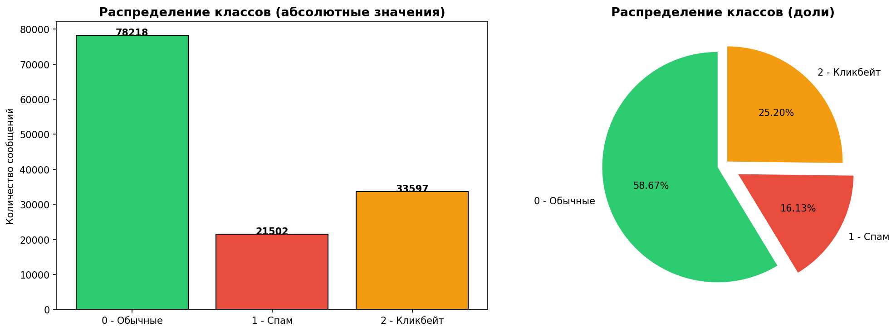
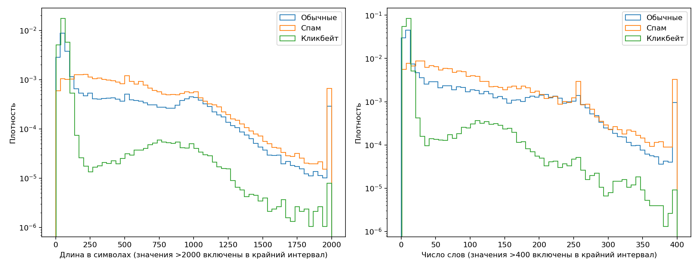

# Техническое описание датасета df.csv

**Кейс:** «Классификация спама и кликбейта: распознавание спам-сообщений и кликбейт-заголовков».

**Команда:** «Великолепная четверка».  

**Датасет:** [Datasets/df.csv](https://github.com/pudoff/SpamClickbaitClassification/tree/main/Datasets/df.csv).

## 1. Назначение и происхождение данных

Задача по кейсу: разработать Telegram-бота, классифицирующего входящие голосовые сообщения в три категории: обычное сообщение, спам и кликбейт. Предусмотрено использование TTS для создания синтетического аудио на основе текстовых примеров.

Датасет `df.csv` представляет собой один объединённый файл, состоящий из 2 столбцов (текст, метка). Количество уникальных меток: 3 (0 - нормальный текст, 1 - спам, 2 - кликбейт). Он собран из восьми отдельных датасетов с Kaggle (отдельные датасеты по кликбейту, отдельные по спаму), большинство из которых были англоязычными, и переведены на русский язык. Представленный скрипт `scripts/TranslateScript.py` использует модель `Helsinki-NLP/opus-mt-en-ru`, пакетную обработку по 32 текста, ограничение входа и генерации до 512 токенов и поиск с четырьмя лучами (`num_beams=4`). Скрипт сохраняет исходный текст, перевод и метку, однако в итоговом `df.csv` оставлены только текст и целевая категория (метка).

## 2. Формат, структура и объём

Файл включает **643 010 записей**. Размер файла — **381,59 МБ**.

| Поле | Тип после восстановления | Назначение |
| --- | --- | --- |
| `text` | строка (`object` в pandas) | Текст сообщения, заголовка либо более длинного материала; в основном русский перевод |
| `is_spam1_or_clickbait2` | целое число (`int64`) | Целевая категория: `0` — обычное сообщение; `1` — спам; `2` — кликбейт |

Файл датасета получился достаточно неоднородным: **638 540**  записей используют запятую перед меткой, **3 198** — точку с запятой. Изначальная загрухка через пандас `pd.read_csv` завершался с ошибкой. Для первичного анализа необходимо было сделать предобработку: из каждой строки извлекаем целочисленную метку после последнего подходящего разделителя `,` или `;`; парные внешние кавычки убираем, отсутствующие категории не угадываем.

| Структура записей датасета | Количество |
| --- | --- |
| Восстановленные пары «текст — целочисленная метка» | 641 738 |
| Повторные заголовки внутри файла | 4 |
| Строки без целочисленной метки | 1 266 |
| Пустые физические строки | 1 |
| Записи с меткой вне категорий `0/1/2` | 1 |
| Записи с допустимой целевой меткой | 641 737 |

Итоговый датафрейм имеет форму **641 738 × 2**. Пропуски `NaN` не обнаружены, однако имеются **два пустых текста**. 

## 3. Распределение классов и характеристики текстов

Доли ниже вычислены по **641 737** записям с допустимыми метками, до удаления повторов и конфликтов.

| Класс | Количество | Доля | Уникальные пары «текст — метка» |
| --- | --- | --- | --- |
| `0` — обычные сообщения | 370 272 | 57,70% | 278 574 |
| `1` — спам | 157 100 | 24,48% | 107 453 |
| `2` — кликбейт | 114 365 | 17,82% | 70 589 |
| **Всего** | **641 737** | **100%** | **456 616** |

Соотношение наибольшего и наименьшего классов составляет **3,24 : 1**. Присутствует дисбаланс в пользу обычных сообщений, но кликбейт не является экстремально редким классом.

Средняя длина текста составляет **370,71 символа**, медиана — **113**, 95-й процентиль — **1 181**, максимум — **5 718** символов. По числу фрагментов, разделённых пробелами, среднее составляет **65,44**, медиана — **17**, 95-й процентиль — **250**, максимум — **1 380**. 

| Класс | Средняя длина, символы | Медиана, символы | Медиана, слова |
| --- | --- | --- | --- |
| Обычные сообщения | 360,94 | 94 | 14 |
| Спам | 601,50 | 486 | 76 |
| Кликбейт | 85,34 | 56 | 9 |

Кликбейт преимущественно представлен короткими заголовками, спам — более длинными сообщениями. Это полезная характеристика, но также возможный источник смещения: модель может опираться на длину и особенности источника вместо содержания. Нужна отдельная оценка короткого спама, длинного кликбейта и обычных заголовков.

Графики: `outputs/eda/class_distribution.png` и `outputs/eda/text_lengths.png`.

## 4. Качество данных и разметки

### Дубликаты и противоречия

Во всем датафрейме обнаружен **185 121 полных дубликатов**, или **28,85% записей**. После удаления полных повторов остаётся **456 617** уникальных пар, включая запись с ошибочной меткой. После исключения этой записи — **456 616** пар.

Среди записей с допустимыми категориями **524 одинаковых текста имеют разные метки**; эти группы содержат **5 289 строк**, или **1 059 уникальных пар «текст — метка»**. Например, материал, начинающийся с «Кто должен заменить Бейонсе в #Coachella? Голосовать!», встречается с категориями `0` и `2`. При приведении регистра, пробелов и `ё/е` число конфликтующих групп увеличивается до **527**, число входящих в них строк — до **5 300**. Это  признак несогласованности разметки,.

Запись «Стоимость запасов была более 69 млрд. долл.» на физической строке **365 055** имеет метку **2000**. Она находится внутри повреждённого фрагмента, где вместо целевых меток встречается исходный английский текст. Запись не берем в работу.

### Содержимое и перевод

Автоматически выявлены следующие признаки; они могут пересекаться и не всегда означают ошибку:

| Признак | Записей | Доля восстановленной таблицы |
| --- | --- | --- |
| Не содержат кириллицы | 19 606 | 3,06% |
| Содержат латинские буквы | 275 798 | 42,98% |
| Содержат `http://`, `https://` или `www.` | 19 797 | 3,08% |
| Содержат HTML-теги или HTML-сущности | 15 943 | 2,48% |
| Короче 10 символов | 1 760 | 0,27% |
| Длиннее 2 000 символов | 6 869 | 1,07% |
| Содержат более 512 слов по пробельному подсчёту | 2 555 | 0,40% |
| Содержат символ замены `�` | 3 | менее 0,01% |

Отсутствие кириллицы не доказывает, что текст англоязычный: встречаются последовательности пунктуации и других символов. Латиница может отражать имена, адреса, сокращения, непереведённые части или ошибки. Среди наиболее частых текстов есть длинные последовательности точек и звёздочек; фраза «Я не знаю, что делать.» встречается **116** раз. В отдельных просмотренных записях наблюдаются неестественные словосочетания и повторяющиеся служебные слова. 

Ограничение перевода до 512 токенов создаёт риск усечения длинных примеров. Число слов не равно числу токенов модели, поэтому 2 555 длинных текстов — ориентир для проверки, а не число доказанных усечений. 
Точность разметки, долю семантических ошибок перевода по представленным данным установить нельзя.

5. Применимость к нашей задаче
Датасет имеет достаточный объём и примеры всех трёх целевых категорий для построения и сравнения первоначальных текстовых моделей, например TF-IDF с логистической регрессией. После очистки и проверки меток тексты также могут использоваться для TTS-синтеза тренировочного аудио.

Применимость ограничена неоднородностью источников, машинным переводом, большим количеством повторов, конфликтующими метками и различиями жанров. Датасет содержит заголовки, бытовые сообщения, письма и длинные материалы;

До обучения необходимо исключить неизвестные категории и пустые тексты, устранить повторы, вынести конфликты на проверку и разделить данные так, чтобы варианты одного текста не попадали одновременно в обучение и тест. 

Стратифицированное разделение 80/20 создало **354 224** обучающих и **88 556** тестовых примеров; совпадающих очищенных текстов между ними — **0**.

 Основные метрики — **macro F1, precision/recall/F1 каждого класса и матрица ошибок**; weighted F1 и accuracy используются дополнительно. Исключение точных совпадений не устраняет утечку парафразов, общих шаблонов и повторов из разных источников.

Для аудиосценария необходимо сформировать независимый тест реальных голосовых сообщений, проверить распознавание речи (ASR) и итоговую классификацию. TTS-версии одного текста, включая разные голоса, должны оставаться в одной части выборки. Синтетическая речь расширяет тренировочные примеры, но сама по себе не подтверждает устойчивость к шуму, разговорной речи и ошибкам распознавания.

**Заключение:** `df.csv` пригоден как исходный учебный датасет для экспериментов с трёхклассовой текстовой классификацией и последующим синтезом аудио. Использовать его как готовую качественно размеченную обучающую выборку без очистки и аудита нельзя. Главные выявленные проблемы — неоднородный формат CSV, около 28,85% повторных записей, конфликтующие метки и неоднородное качество переводов. Применимость к реальным голосовым сообщениям должна быть подтверждена отдельной оценкой.

## 6. Предобработка и выборка для экспериментов

В ноутбуках `1_TFIDF_LogisticRegression.ipynb` и `2_RNN_CNN_LR.ipynb` реализован один метод предобработки — **нормализация текста регулярными выражениями**: удаление HTML, упоминаний и хештегов, маскирование URL/чисел, приведение к нижнему регистру, `ё→е`, удаление пунктуации и эмодзи, схлопывание пробелов. Для TF-IDF это уменьшает словарь случайных чисел и адресов; для нейросети создаёт последовательности токенов. Метод не использует лемматизацию или трансформерные представления.

Перед разделением текущие ноутбуки исключают неизвестные метки, полные raw-повторы и raw-тексты с несколькими метками:

| Этап текущих ноутбуков | Примеров |
| --- | ---: |
| Загружены допустимые классы | 641 737 |
| Удалены повторные пары | 185 128 |
| Остались уникальные raw-пары | 456 609 |
| Исключены raw-конфликты: 525 текстов | 1 061 |
| Корпус для экспериментов | **455 548** |
| Обучение, 80%, stratify, seed=42 | **364 438** |
| Тест, 20% | **91 110** |

В RNN добавлен эвристический профиль «шумных/чистых» сегментов. По сохранённому выводу флаги низкой доли кириллицы, caps, URL и повтора слова четыре раза объединяют **66 887 сообщений (14,68%)**, без флагов — **388 661 (85,32%)**. Отдельно: низкая доля кириллицы 20 292 (4,45%), caps 1 228 (0,27%), URL 13 905 (3,05%), повтор слова 46 063 (10,11%). Признаки пересекаются. Это **эвристические сегменты, а не измеренная точность разметки**: URL и caps могут быть нормальными признаками спама; отсутствие флага не гарантирует правильный перевод или категорию. Формула доли кириллицы дополнительно нуждается в исправлении регистра. Заявленные в ноутбуке «0,71% ошибок разметки» и «потолок accuracy 99,3%» не подтверждены ручным аудитом и не принимаются как оценка качества датасета.

## 7. Методы классификации и обоснование выбора

**TF-IDF + LogisticRegression.** В baseline используются словные униграммы/биграммы; во второй модели объединяются word- и `char_wb`-n-граммы. Символьные признаки потенциально полезны для окончаний, опечаток и шаблонных фрагментов спама, словные — для содержательных сочетаний. Для исходной модели вполне подходит: она работает с разреженными признаками, сравнительно проста для воспроизведения и развёртывания. Объединение word/char в FeatureUnion — объединение признаков одной модели, а не ансамбль предсказаний.

В ноутбуке `1_TFIDF_LogisticRegression.ipynb` GridSearchCV подбирает C, затем шесть запусков исследуют ёмкость словаря, n-граммы, масштаб char-ветви, регуляризацию и веса классов. Логируются параметры, несколько метрик, модели и матрицы ошибок. Текущие размеры расширенных словарей — до 150 000 признаков на ветвь.

**Гибридная RNN.** В `2_RNN_CNN_LR.ipynb` реализованы word-Embedding → однослойная BiGRU → attention pooling, параллельная символьная CNN и 12 поверхностных признаков. Выходы объединяются в классификатор трёх категорий. По сохранённой архитектуре — около **8,11 млн параметров**, словарь **60 000**, word/char-входы длины **256**. В word-вход подаются слова, а затем биграммы; ограничения такого порядка и усечения описаны в ревью. Обучение: AdamW, clipping, OneCycleLR, dropout, три эпохи; в истории суммарно **140,8 минуты на CPU**. 

RNN выбрана для проверки гипотезы о пользе последовательного контекста, CNN — локальных символьных паттернов. TF-IDF с n-граммами уже учитывает локальный порядок, но не моделирует длинную последовательность так же, как GRU. Причину прироста нельзя приписать одной архитектуре без абляций: также менялись представление текста, дополнительные признаки и class weights.

**Ансамбль.** Кандидаты — TF-IDF/LR, гибридная RNN и отдельный трёхслойный char-CNN. Перебор с шагом 0,1 выбрал **RNN 0,8; char-CNN 0,2; TF-IDF/LR 0,0**. Таким образом, в финальном предсказании участвуют **две модели**:

`p_ensemble = 0,8 × p_RNN + 0,2 × p_charCNN`.

Используются семейства методов вебинара 4; **трансформеры в классификаторах не применяются**. Attention pooling над GRU не является Transformer-моделью.

## 8. Результаты моделей

Результаты ниже относятся к тесту из **91 110 сообщений**. 

| Модель | Accuracy | Macro-F1 | Weighted-F1 |
| --- | ---: | ---: | ---: |
| TF-IDF word + LR | 0,7948 | 0,7715 | 0,8039 |
| TF-IDF word+char + LR, контроль | 0,8093 | 0,7822 | 0,8165 |
| TF-IDF word+char + LR, текущий run_6 exp5 | 0,8394 | 0,8087 | 0,8432 |
| TF-IDF word+char + LR, фактический финальный run_7/exp4 | 0,8296 | 0,8006 | 0,8353 |
| Отдельный char-CNN | 0,8452 | 0,7961 | 0,8408 |
| Гибрид BiGRU/char-CNN + поверхностные признаки | 0,8630 | 0,8242 | 0,8620 |
| **Ансамбль 0,8 RNN + 0,2 char-CNN** | **0,8677** | **0,8282** | **0,8661** |

| Класс ансамбля | Precision | Recall | F1 | Support |
| --- | ---: | ---: | ---: | ---: |
| Обычные | 0,8874 | 0,9027 | 0,8950 | 55 610 |
| Спам | 0,9136 | 0,9271 | 0,9203 | 21 415 |
| Кликбейт | 0,7027 | 0,6393 | 0,6695 | 14 085 |

Основная метрика — macro-F1, поскольку каждый класс получает равный вес. Accuracy приведена также для шкалы оценивания Task1; weighted-F1 показывает результат с учётом частот. Средний результат не заменяет отдельную оценку кликбейта.

## 9. Анализ неправильно классифицированных объектов

Матрица ошибок ансамбля: строки — истинный класс, столбцы — предсказание.

| Истинный класс \ Предсказание | Обычные | Спам | Кликбейт |
| --- | ---: | ---: | ---: |
| Обычные | 50 197 | 1 740 | 3 673 |
| Спам | 1 424 | 19 854 | 137 |
| Кликбейт | 4 943 | 138 | 9 004 |

Всего **12 055 ошибок (13,23%)**. Основная трудность — граница обычного сообщения и кликбейта: **4 943 кликбейта признаны обычными**, **3 673 обычных — кликбейтом**. Эти направления дают **71,47% всех ошибок**. Пропуски кликбейта важны для полноты, ложные срабатывания на обычных заголовках — для precision и пользовательского доверия.

Воспроизводимая выборка ошибок показывает, например:

| Фрагмент | Истинная метка | Предсказание | Интерпретация для дальнейшего аудита |
| --- | --- | --- | --- |
| «Наоми Скотт играла Дарта Маула в лимонаде.» | Кликбейт | Обычные, p≈0,89 | Неестественная формулировка; нужно сверить исходник, перевод и правило кликбейта. Высокая уверенность не исключает ошибки |
| «Если программист напрямую не проверяет границы массива…» | Спам | Обычные, p≈0,79 | Отрывок похож на технический текст; нужно проверить полное сообщение и исходную метку, а не автоматически считать модель единственной причиной |
| «.. .. .. ..что хитроумное блюдо…» | Обычные | Кликбейт, p≈0,65 | Пунктуационный шум и короткий остаток после очистки; проверить повреждение записи и достаточность контекста |

## 10. Обработка данных после классификации

В RNN-ноутбуке вероятности преобразуются в маршруты: уверенные обычные сообщения пропускаются, уверенный спам/кликбейт получает автоматическую метку, остальные направляются на ручную проверку. Пороги — **0,85** для автоматического решения и **0,60** для разделения типов ручной проверки. Короткий текст ≤3 слов при предсказании спам/кликбейт отправляется вручную независимо от уверенности.

| Результат маршрутизации | Значение |
| --- | ---: |
| Автоматически обработано | 57 238 / 62,82% |
| Accuracy автоматического подмножества | 96,59% |
| Отправлено на ручную проверку | 33 872 / 37,18% |
| Ошибок среди автоматических решений | 1 954 / 3,41% |
| Спам/кликбейт, ошибочно автоматически пропущенные как обычные | **1 060**: 368 спам + 692 кликбейт |

Accuracy 96,59% относится к выбранному автоматическому подмножеству и **не заменяет общую accuracy 86,77%**. 

## 11. Итог по заданию и дальнейшая работа

| Требование | Текущее состояние |
| --- | --- |
| Покрытие, состав и структура датасета | Описаны в разделах 1–3 и 6 |
| Качество данных, нормализация, доли сегментов | Описаны с различием автоматических флагов и подтверждённой разметки |
| Качество транскрипций | Не оценивалось: отсутствует аудио/эталон ASR |
| Один метод предобработки | Регулярная нормализация реализована; требуется исправление отдельных случаев |
| Классификация методом вебинара 4 без трансформеров | Реализованы LR, GRU и CNN |
| Ансамбль с весами на validation | Усреднение реализовано; независимость подбора весов требует исправления |
| Анализ ошибочных объектов | Есть матрица, подгруппы и примеры; требуется ручной аудит причин |
| Обработка после классификации | Реализована offline-маршрутизация |
| Обоснование выбора, результаты и ссылка на репозиторий | Включены в этот отчёт |
| Ссылка на отчёт в ЛМС | Прикрепляется пользователем после публикации согласованной версии |

Лучший сохранённый результат — **86,77% accuracy**,  соответствует диапазону ≥85%, но <90% по задаче. 

Дальнейшая работа будет строится в направлении разбора голосовых сообщений  - голосовой тест, ASR, TTS и Telegram-интеграция полного кейса.
